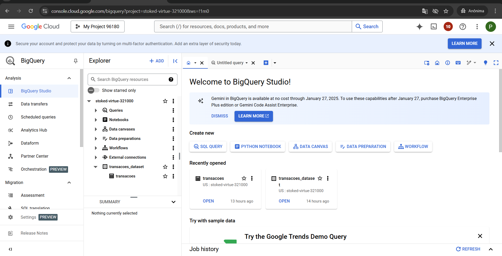
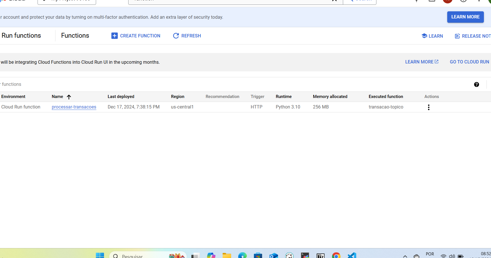

# Exemplo prático

Aqui está um exemplo prático utilizando GCP com os serviços Pub/Sub, API para envio de dados, Cloud Functions e BigQuery. Essa solução aborda a ingestão de dados em tempo real em um pipeline que termina no BigQuery para análise.

# Cenário Prático

Objetivo: Criar um pipeline que receba dados de uma API, envie esses dados ao Pub/Sub, processe-os em tempo real usando Cloud Functions, e grave os dados no BigQuery.

Exemplo de aplicação: Captura de dados de transações de pagamento.

# Componentes do Pipeline
Pub/Sub: Canal de mensagens para ingestão de dados.
API: Uma aplicação que simula o envio de dados para o Pub/Sub.
Cloud Functions: Processa os dados recebidos pelo Pub/Sub e grava no BigQuery.
BigQuery: Banco de dados analítico para armazenar os dados processados.


# Implementação
1. Criar um Tópico no Pub/Sub
No console do GCP:
Navegue até Pub/Sub > Tópicos > Criar Tópico.
Nomeie o tópico (ex: transacoes-topico).


2. Configurar o BigQuery
Crie um Dataset no BigQuery:
Nomeie o dataset (ex: transacoes_dataset).
Crie uma tabela no dataset:
Nome: transacoes.
Esquema:
id_transacao: STRING
valor: FLOAT
timestamp: TIMESTAMP


3. Criar uma API para Envio de Dados
Implemente uma API simples que envia dados ao Pub/Sub. Você pode usar Flask em Python para isso:

Passos para implantação:
Salve o código em um arquivo app.py.
Execute localmente para teste ou implante no Cloud Run.


```

from flask import Flask, request, jsonify
from google.cloud import pubsub_v1

app = Flask(__name__)

# Configurações do Pub/Sub
PROJECT_ID = "stoked-virtue-321000"
TOPIC_ID = "transacoes-topico"
publisher = pubsub_v1.PublisherClient()
topic_path = publisher.topic_path(PROJECT_ID, TOPIC_ID)

# Rota principal
@app.route('/')
def home():
    return "API Pub/Sub está funcionando! Use a rota /enviar para enviar dados.", 200

@app.route('/enviar', methods=['POST'])
def enviar_dados():
    try:
        dados = request.json
        # Envia a mensagem ao Pub/Sub
        mensagem = str(dados).encode("utf-8")
        future = publisher.publish(topic_path, mensagem)
        future.result()  # Garante que a mensagem foi enviada
        return jsonify({"status": "sucesso", "message_id": future.result()}), 200
    except Exception as e:
        return jsonify({"status": "erro", "mensagem": str(e)}), 500

if __name__ == '__main__':
    app.run(debug=True)

```

4. Criar uma Cloud Function
A Cloud Function será acionada pelo Pub/Sub e gravará os dados no BigQuery.

Código da Cloud Function:

```
import base64
import json
from google.cloud import bigquery

def processar_dados(event, context):
    client = bigquery.Client()

    # Nome da tabela no BigQuery
    tabela_id = "seu-projeto-id.transacoes_dataset.transacoes"

    # Decodificar os dados recebidos
    dados = base64.b64decode(event['data']).decode('utf-8')
    dados_json = json.loads(dados)

    # Criação da linha para inserir no BigQuery
    linha = [{
        "id_transacao": dados_json["id_transacao"],
        "valor": float(dados_json["valor"]),
        "timestamp": dados_json["timestamp"]
    }]

    # Inserção no BigQuery
    errors = client.insert_rows_json(tabela_id, linha)
    if errors:
        print(f"Erro ao inserir dados no BigQuery: {errors}")
    else:
        print("Dados inseridos com sucesso.")

```

Passos para implantação:
No GCP, vá para Cloud Functions > Criar Função.
Configure:
Nome: processar-transacoes.
Trigger: Pub/Sub > transacoes-topico.
Runtime: Python 3.x.
Copie o código acima no editor e implante.

# Bigquery



# Cloud Functions




